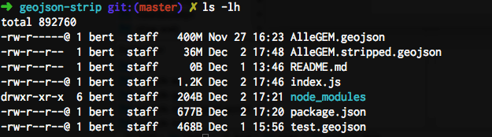

# geojson-strip

Removes all properties from all features in specified input GeoJSON file.



## Usage

    $ node index.js file.geojson > file.stripped.geojson

Or:

    $ node index.js -o file.stripped.geojson file.geojson

## Example

From:

```json
{
  "type": "FeatureCollection",
  "features": [
    {
      "type": "Feature",
      "properties": {
        "a": 1,
        "b": 2,
        "c": 3
      },
      "geometry": {
        "type": "Point",
        "coordinates": [52.434, 5.32]
      }
    },
    {
      "type": "Feature",
      "properties": {
        "d": 4,
        "e": 5,
        "f": 6
      },
      "geometry": {
        "type": "Point",
        "coordinates": [52.012, 5.01]
      }
    }
  ]
}
```

To:

```json
{
  "type": "FeatureCollection",
  "features": [
    {
      "type": "Feature",
      "properties": {},
      "geometry": {
        "type": "Point",
        "coordinates": [52.434, 5.32]
      }
    },
    {
      "type": "Feature",
      "properties": {},
      "geometry": {
        "type": "Point",
        "coordinates": [52.012, 5.01]
      }
    }
  ]
}
```
